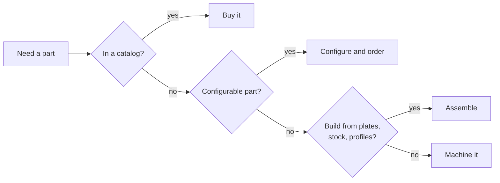

# 2. Buy, assemble, or machine?

The cheapest part is the one you don't have to make

---

# Decide in this order

Your own design time counts too. A €150 catalog stage is cheap compared to a week of designing and a week of machining.

---

# Catalog components

### Positioning and optics

- Optical posts, mounts, breadboards
- Linear and rotation stages, micrometer heads
- Kinematic mounts (see section 6)

### Structure

- Aluminum extrusion profiles and brackets
- Standard angle brackets, gussets, T-nuts

### Configurable parts

- Shafts, spacers, plates, blocks cut to your dimensions
- Choose length, holes, and threads from a web form
- Typically delivered in days, with a known price

### Machine elements

- Dowel pins, bearings, bushings, springs
- Shaft collars, couplings, leveling feet

Add the suppliers our lab already has accounts with.

---

# Design with standard stock

Material comes in standard sizes. Use them:

- **Plate**: e.g. 5, 6, 8, 10, 12, 15, 20, 25, 30 mm
- **Round and square bar**, **flat bar**
- **Tube**: round, square, rectangular
- **Angle** and **channel**

Replace with the sizes our supplier stocks.

If a part is 20 mm thick, draw it 20 mm, not 18.5 mm:

- The faces can stay as delivered
- One fewer operation
- Less material removed, so less distortion

Rolled plate is not precision flat or precise in thickness. If a face matters, it must be machined, or use cast tooling plate.

---

# One block or three plates?

<Sketch name="monolith-vs-plates" class="h-96" hint="The same bracket twice: milled from one solid block, and bolted together from three plates" />

---

# Plates instead of a monolithic block

### Why plates win

- Each plate is mostly **one setup**
- 2D profiles can be **laser or waterjet cut**
- Start from standard thicknesses
- Change one plate, not the whole part
- Deep "pockets" become open space between plates

### What to watch

- Joints need screws and **alignment** (dowel pins)
- Stiffness depends on the joints
- More parts to assemble and keep track of
- Tolerances add up across plates (see section 5)

An L-bracket from two plates and four screws is often faster than one milled L, and easier to modify.

---
class: text-sm
---

# The main processes

| Process | Good at | Bad at |
|---|---|---|
| **CNC milling** | Prismatic parts, pockets, precise faces and holes | Deep narrow features, sharp internal corners, many setups |
| **CNC turning** | Round parts: shafts, spacers, flanges. Fast and accurate | Anything that isn't rotationally symmetric |
| **Laser cutting** | Fast 2D profiles in sheet and thin plate | Thick plate, heat-affected edges, no pockets or threads |
| **Waterjet cutting** | Thick plate, almost any material, no heat | Tapered, rougher edges; lower accuracy |
| **Sheet metal bending** | Enclosures, brackets, covers. Light and cheap | Minimum flange lengths, bend radii, loose tolerances |
| **Welding** | Large frames, joining thick sections | Distortion; precise faces need machining afterward |
| **3D printing** | Complex shapes, jigs, quick iterations | Anisotropic strength, creep, accuracy, outgassing |

Combine them: a laser-cut plate with a few milled precision features is often the sweet spot.

<!--
Don't go deep here. The goal is that they know these processes exist and roughly what they're for, so they can ask the workshop "could this be laser cut?"
-->

---

# Section 2: take-aways

<v-clicks>

- **Buy** before you design: catalog and configurable parts are fast and cheap
- Design around **standard stock sizes**
- Build assemblies from **simple plates** instead of carving one monolith
- Pick the **process** that suits the shape, not the other way around

</v-clicks>
