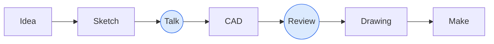

# Communicating with the workshop

Talk to the machinist [before]{.marker} the design is finished

---
layout: two-cols-header
---

# A STEP file says [too little]{.marker}

::left::

### A STEP file contains

- Geometry

::right::

<v-click>

### A STEP file does not tell the workshop

- **Tolerances**: which dimensions matter, and how much
- **Material**: the exact grade and form
- **Threads**: often just plain holes in the model
- **Finish**: coating, Ra, edge breaks, cleaning
- **Quantity**, and whether spares are needed
- **What the part does**, and what's critical

</v-click>

::bottom::

<v-click at="1">

Send the STEP file <strong>and</strong> a PDF drawing. The drawing is the specification.

</v-click>

---

# A STEP file says [too much]{.marker}

The model is the specification for **every** surface, including the ones you never made a decision about.

|  | The model says …, | so the workshop … | 
While you meant …Do instead
 |
|:---|:---|:---|:---|
| <Sketch class="cell-sketch" data-id="sk-flat" name="step" layer="flat" hint="The hole as drawn: a flat, square floor" /> | this floor is <strong>flat and square</strong> | adds an end-mill operation | 
a hole about 12 deepDimension the depth, drill point  and all <Link to="holes-threads">Holes and threads</Link>
 |
| <Sketch class="cell-sketch" data-id="sk-fillet" name="step" layer="fillet" hint="The edge as drawn: an R3 round, on this one edge" /> | R3, on this exact edge | produces that exact form | 
no sharp edge hereA <strong>chamfer</strong> or an <strong>edge break</strong>  is usually what you meant
 |
| <Sketch class="cell-sketch" data-id="sk-corner" name="step" layer="corner" hint="The corner as drawn: a sharp internal corner, zero radius" /> | <strong>zero radius</strong>, internal | phones you, or guesses | 
a cornerGive it a radius that matches a tool  they <strong>already have</strong> (or slightly larger)
 |

<FancyArrow v-click="1" from="[data-id=sk-flat]@bottomleft" to="[data-id=sk-flat]@topright"
  color="var(--sk-alert)" width="2" head-size="0" />
<FancyArrow v-click="1" from="[data-id=sk-fillet]@bottomleft" to="[data-id=sk-fillet]@topright"
  color="var(--sk-alert)" width="2" head-size="0" />
<FancyArrow v-click="1" from="[data-id=sk-corner]@bottomleft" to="[data-id=sk-corner]@topright"
  color="var(--sk-alert)" width="2" head-size="0" />
<FancyArrow v-click="1" from="[data-id=sk-sharp]@bottomleft" to="[data-id=sk-sharp]@topright"
  color="var(--sk-alert)" width="2" head-size="0" />

Nobody can ask "did you mean this?" about every surface. If you drew it, they make it, and you pay for it.

Where the form is <strong>free</strong>, write on the drawing that it is free.

<!--
The two failure modes are different, and worth saying out loud. The flat bottom is possible, so they build it and bill you for it. The sharp internal corner is impossible, so they have to deviate — and that deviation is a guess about whether anything seats into that corner. Either way the decision left your desk without you making it.
-->

---
layout: two-cols-header
cols: 3/4
---

# What a drawing needs

::left::

- Views with **datums** (A, B, C)
- **Units** (mm)
- **Material**: grade and form,  e.g. "[EN AW-6082 T6, plate]{.technical}"
- **General tolerance**  e.g. "[ISO 2768-mK]{.technical}"
- **Critical features** with explicit tolerances,  clearly marked

::right::

- **Threads** with depth: "[M6 ↧ 12]{.technical}"
- **Finish**: coating, masking, Ra, edge breaks, cleaning
- **Quantity**
- **Revision**, date, and **contact person**
- A note on **function**, if it helps

::bottom::

The drawing has to be right the first time. It is the one document the workshop builds from, and nobody checks your intent against it.

In CAD, undo is your most-used command. A workshop only has redo.

---
layout: two-cols-header
align: stretch
---

# Dimension from datums

::left::

### Chain dimensioning

Each hole dimensioned from the previous one.

- Tolerances **add up** along the chain
- Hole 5 can be off by 4 × the tolerance
- The machinist has to add up numbers

<Sketch name="dimensioning-chain-baseline" layer="chain" class="h-32" hint="Four holes in a row, each dimensioned from the previous one" />

::right::

### Baseline dimensioning

Each hole dimensioned from **one datum**.

- Every feature has **its own** tolerance
- Matches how the part is **clamped and measured**
- Easy to program

<Sketch name="dimensioning-chain-baseline" layer="baseline" class="h-32" hint="The same four holes, each dimensioned from the left datum" />

::bottom::

Dimension the way the part <strong>functions</strong>: from the faces and holes it's aligned by.

---
layout: two-cols-header
align: center
---

# Hole tables

::left::

**Label** the holes on the view, and put the numbers in a table.

- Every hole located from **one origin**
- Diameter, depth and thread in the same row
- The view stays readable, and a revision is **one number**, not an arrow in a thicket

::right::

  If the distance <strong>between</strong> two holes matters, dimension that pair <strong>directly</strong>, and let the table carry the rest.

Put the origin where the part is <strong>located and clamped</strong>. Ask the workshop if you are unsure.

<!--
Set this up before the bullets: a plate with forty holes, dimensioned the normal way, is eighty dimensions stacked on top of the geometry. Nobody can read it, and one misplaced arrow is a scrapped part. The warning is the same reason chain dimensioning fails, on the previous slide.
-->

---
layout: two-cols
---

# One origin, one table

::left::

  <Sketch name="hole-thicket-table" layer="thicket" v-click.hide="1" hint="The plate with every hole dimensioned the normal way" />
  <Sketch name="hole-thicket-table" layer="table" v-click="1" hint="The same plate, the dimensions gone, the holes numbered" />

::right::

<v-click at="1">

| Hole | X | Y | Ø / thread |
|---|---:|---:|---|
| 1 | -12.25 | 10.99 | ⌀4.5 |
| 2 | -1.00 | 22.50 | ⌀2.8 |
| 3 | 3.00 | 25.50 | ⌀2.0 |
| 4 | 5.01 | 6.00 | ⌀1.5 ↧ 3.16 |
| 5 | 5.10 | 0.00 | ⌀2.8 csink verso |
| 6 | 10.89 | 14.41 | ⌀4.5 |
| 7 | 10.89 | 14.41 | ⌀12.5 ↧ 3.46 |
| 8 | 11.00 | 25.50 | ⌀2.0 |
| 9 | 13.20 | 21.50 | ⌀1.5 ↧ 3.00 |
| 10 | 15.00 | 24.00 | M3 ⌀2.5 |
| 11 | 15.40 | 0.00 | ⌀12.0 |
| 12 | 15.40 | 0.00 | ⌀13.0 ↧ 3.00 |
| 13 | 16.30 | 21.00 | M2 ⌀1.6 |
| 14 | 20.55 | 8.92 | ⌀2.8 csink verso |
| 15 | 25.79 | 6.00 | ⌀1.5 ↧ 3.16 |

</v-click>

<!--
Sit on the thicket for a moment before clicking: let them try to read a
dimension off it. One click and the arrows go, the plate stays put, and the
table arrives beside it. Draw the two sketches on one page and erase the
dimensions for the second export, so the geometry registers exactly.
-->

---
layout: two-cols-header
---

# Talk to the machinist early

::left::

- Changes on a **sketch** cost minutes
- Changes in a **finished drawing** cost hours
- Changes to a **made part** cost the part

::right::

### Questions to ask

- "Could this be bought, or laser cut?"
- "Do we have this material in stock?"
- "How would you make this?"
- "Which feature makes this expensive?"
- "Which tolerances can you hold easily?"

---

# Take-aways

- A STEP file is **geometry**, not a specification
- A drawing needs **material, tolerances, finish, quantity**, and marked critical features
- Dimension from **datums**
- **Talk to the machinist before the design is finished**

