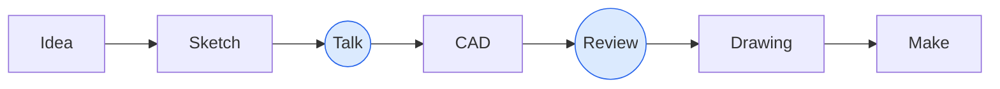

# 11. Communicating with the workshop

Talk to the machinist before the design is finished

---

# Why a STEP file is not enough

### A STEP file contains

- Geometry

### A STEP file does not tell the workshop

- **Tolerances**: which dimensions matter, and how much
- **Material**: the exact grade and form
- **Threads**: often just plain holes in the model
- **Finish**: coating, Ra, edge breaks, cleaning
- **Quantity**, and whether spares are needed
- **What the part does**, and what's critical

Send the STEP file <strong>and</strong> a PDF drawing. The drawing is the specification.

---

# What a drawing needs

- Views with **datums** (A, B, C)
- **Units** (mm)
- **Material**: grade and form, e.g. "EN AW-6082 T6, plate"
- **General tolerance**: e.g. "ISO 2768-mK"
- **Critical features** with explicit tolerances, clearly marked

- **Threads** with depth: "M6 ↧ 12"
- **Finish**: coating, masking, Ra, edge breaks, cleaning
- **Quantity**
- **Revision**, date, and **contact person**
- A note on **function**, if it helps

Add our workshop's drawing template and a good example drawing.

---

# Dimension from datums

### Chain dimensioning

Each hole dimensioned from the previous one.

- Tolerances **add up** along the chain
- Hole 5 can be off by 4 × the tolerance
- The machinist has to add up numbers

### Baseline dimensioning

Each hole dimensioned from **one datum**.

- Every feature has **its own** tolerance relative to the reference
- Matches how the part is **clamped and measured**
- Easy to program

Dimension the way the part <strong>functions</strong>: from the faces and holes it's aligned by.

---

# Chain vs. baseline

<Sketch name="chain-dimensioning" class="h-88" hint="A plate with five holes, each dimensioned from the previous hole" />

<Sketch name="baseline-dimensioning" class="h-88" hint="The same plate, every hole dimensioned from datum edges A and B" />

---

# Talk to the machinist early

- Changes on a **sketch** cost minutes
- Changes in a **finished drawing** cost hours
- Changes to a **made part** cost the part

### Questions to ask

- "How would you make this?"
- "Which feature makes this expensive?"
- "Which tolerances can you hold easily?"
- "Do we have this material in stock?"
- "Could this be bought, or laser cut?"

---

# Section 11: take-aways

- A STEP file is **geometry**, not a specification
- A drawing needs **material, tolerances, finish, quantity**, and marked critical features
- Dimension from **datums**
- **Talk to the machinist before the design is finished**

